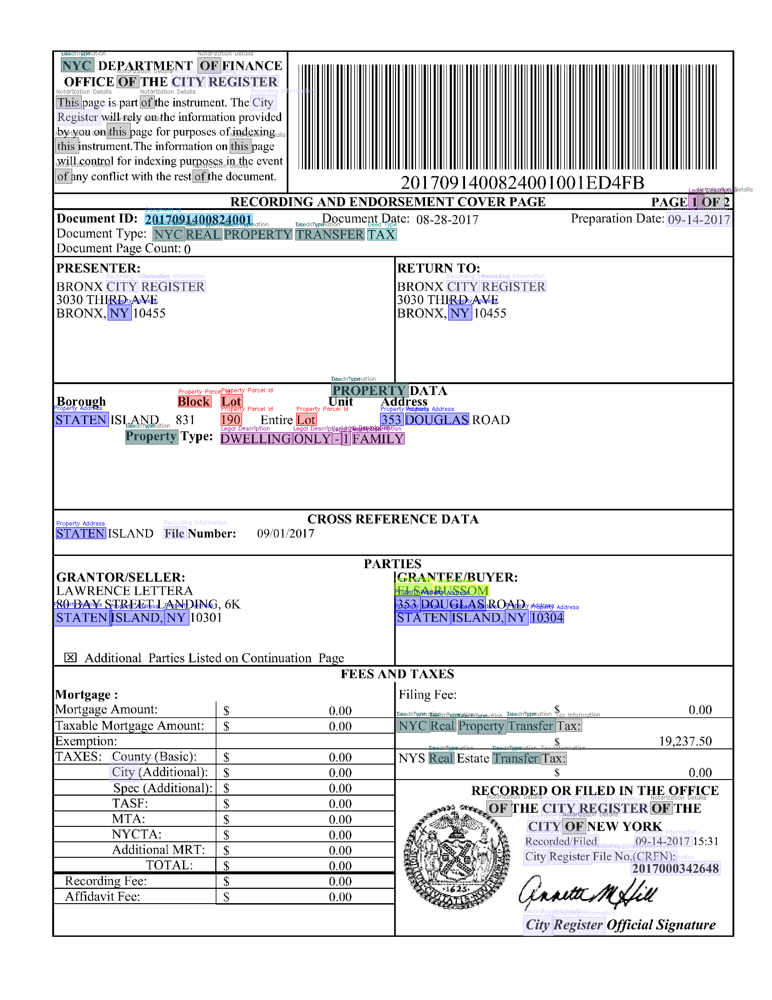
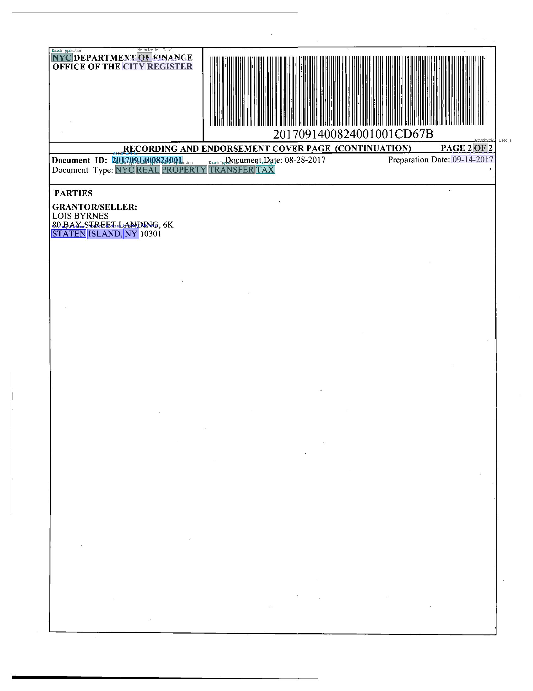
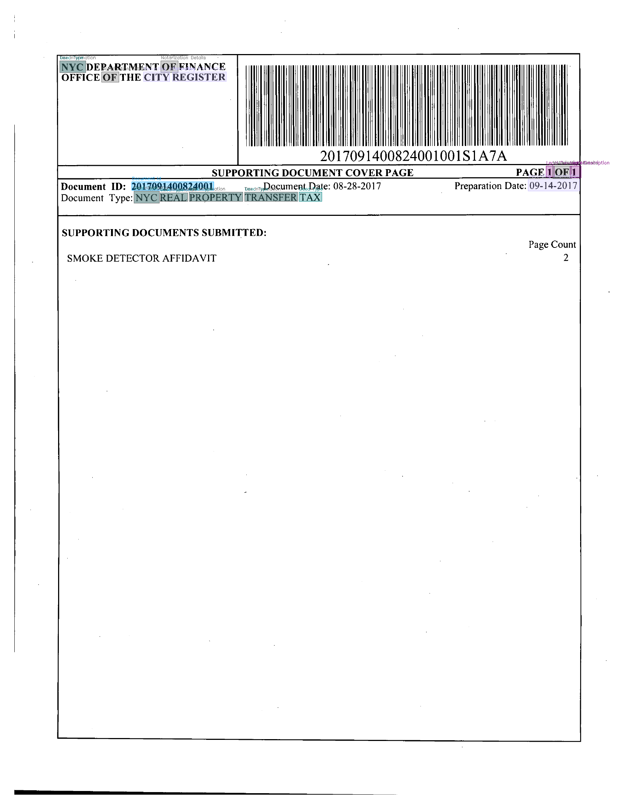
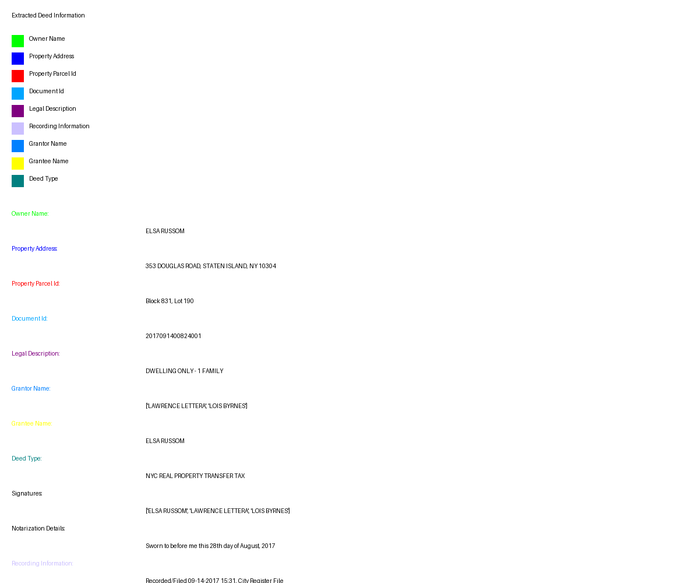

# Deed OCR Analysis & Visualization

Extract and visualize key information from US property deeds using OCR, GPT-4, and computer vision.


## Visualized info extracted from deed





## Files

- `main.py` - Main script for OCR and GPT-4 information extraction
- `deed_visualize.py` - Visualization script for highlighting and summarizing extracted information
- `requirements.txt` - Project dependencies

## Sample Data

The repository includes sample data in the `images/` directory:
- `page-1.png` - Recording and Endorsement Cover Page
- `page-2.png` - Continuation Page
- `page-3.png` - Supporting Document Cover Page
- `summary.png` - Example of generated summary visualization
- Sample extracted information in `extracted_info.json`

## Installation

```bash
pip install -r requirements.txt
```

## Environment Setup

1. Set your OpenAI API key:
```bash
export OPENAI_API_KEY='your-key-here'
```

2. Choose GPU backend in the code:
- For NVIDIA: `.to("cuda")`
- For Apple Silicon: `.to("mps")`

## Usage

### Information Extraction
Run the main script:
```bash
python main.py
```

### Visualization
Run the visualization script:
```bash
python deed_visualize.py
```

## Output

The tool creates a `deed_visualizations` directory containing:
- Annotated PDF pages with color-coded highlights
- Summary visualization image
- Extracted information in JSON format

Example JSON output:
```json
{
  "owner_name": "ELSA RUSSOM",
  "property_address": "353 DOUGLAS ROAD, STATEN ISLAND, NY 10304",
  "property_parcel_id": "Block 831, Lot 190",
  "document_id": "2017091400824001",
  "legal_description": "DWELLING ONLY - 1 FAMILY"
  ...
}
```

## Color Code Legend

- Owner Name: Green
- Property Address: Red
- Parcel ID: Blue
- Document ID: Orange
- Legal Description: Purple
- Recording Info: Pink
- Grantor Name: Dark Orange
- Grantee Name: Cyan
- Deed Type: Olive

## Project Structure

```
deed_extractor/
├── main.py
├── deed_visualize.py
├── requirements.txt
├── images/
│   ├── page-1.png
│   ├── page-2.png
│   ├── page-3.png
│   └── summary.png
└── extracted_info.json
```
